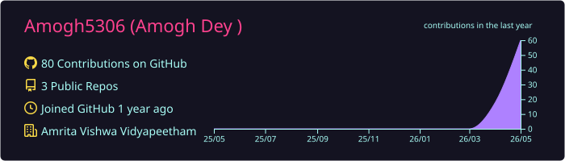
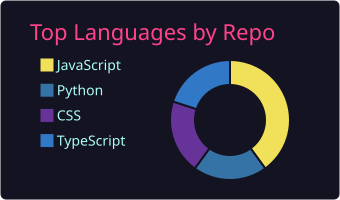
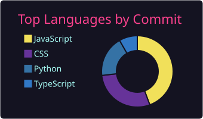
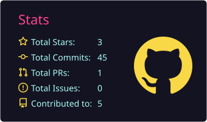

<!-- ANIMATED HEADER -->

 

<!-- SOCIAL BADGES -->

---

### About Me

  

---

### Tech Stack

  

**Main skills**

  
Languages, Frameworks, and Tools I use daily:

  

 

  

---

### Featured Projects

<table>
<tr>
<td width="50%">

#### [Keyboard Price Tracker](https://github.com/Amogh5306/keyboard-price-tracker)
Full-stack data pipeline — scrapes e-commerce prices, serves via Flask API, visualizes with Chart.js

`Python` `Flask` `BeautifulSoup` `Chart.js` `Data Visualization` `Automation`

[Live Demo →](https://amogh-keyboard-tracker.vercel.app)

</td>
<td width="50%">

#### [Personal Portfolio](https://github.com/Amogh5306/portfolio)
Premium animated portfolio with dark/light mode, custom cursor physics, and glassmorphism

`React 19` `Tailwind v4` `Framer Motion` `Vite` `Responsive Design`

[Live Site →](https://amoghdey-portfolio.vercel.app)

</td>
</tr>
</table>

---

### GitHub Stats

  

 

  

#### Summary Cards

  <table>
    <tr>
      <td></td>
      <td></td>
    </tr>
    <tr>
      <td></td>
      <td></td>
    </tr>
  </table>

---

### 🎯 Current Goals

- [ ] Master Data Engineering pipelines with Apache Airflow
- [ ] Implement CI/CD for all personal projects
- [ ] Contribute to major Open Source libraries

---

#### "The best error message is the one that never shows up."
*Always building, always learning.*

<!-- Last profile update: 2026-05-06 -->
